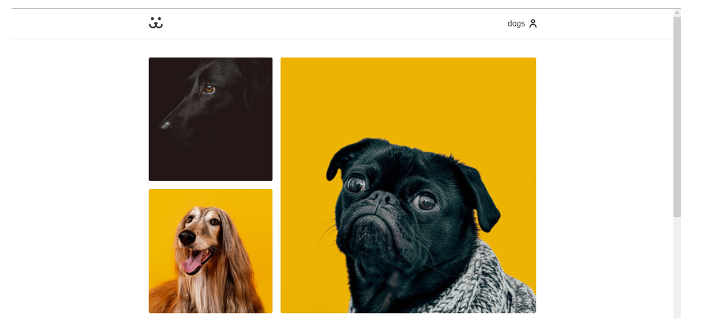
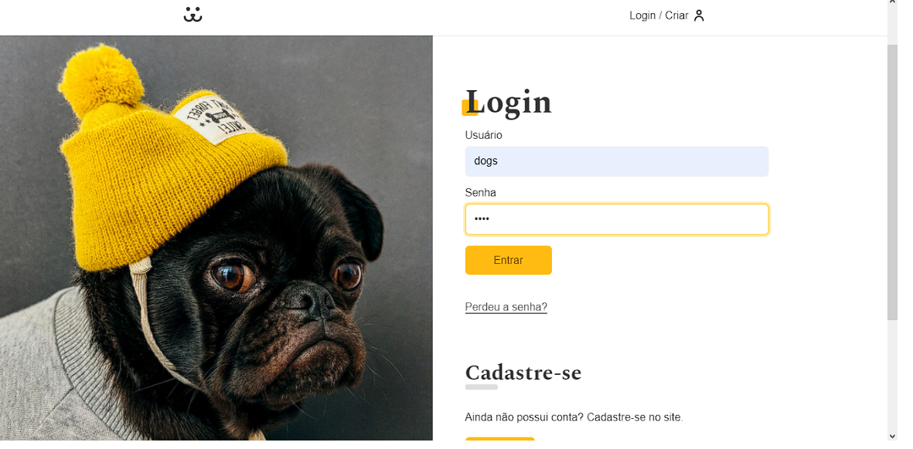
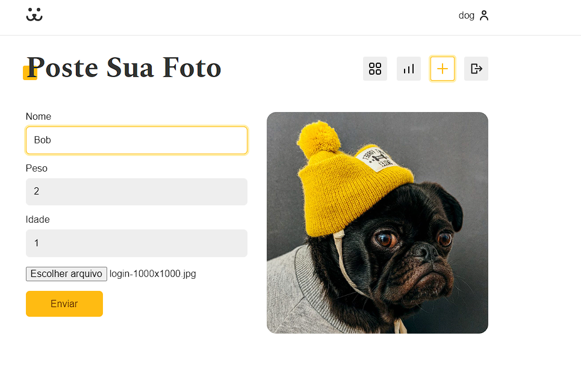

# React Dogs Frontend


## Sobre

<p>
  Rede social criada com o intuito de compartilhamento de fotos de animais. Durante o processo de desenvolvimento foram utilizados os conceitos aprendidos em aula como React Hooks, Context e o uso de estados.
</p>

## Como rodar?
No diretório do projeto execute:

```bash
 yarn start
```

Abra o navegador e accesse [http://localhost:3000](http://localhost:3000).

Para rodar os testes execute:

```bash
  yarn test
```

## Aplicação em execução
<br>


<br>


<br>

